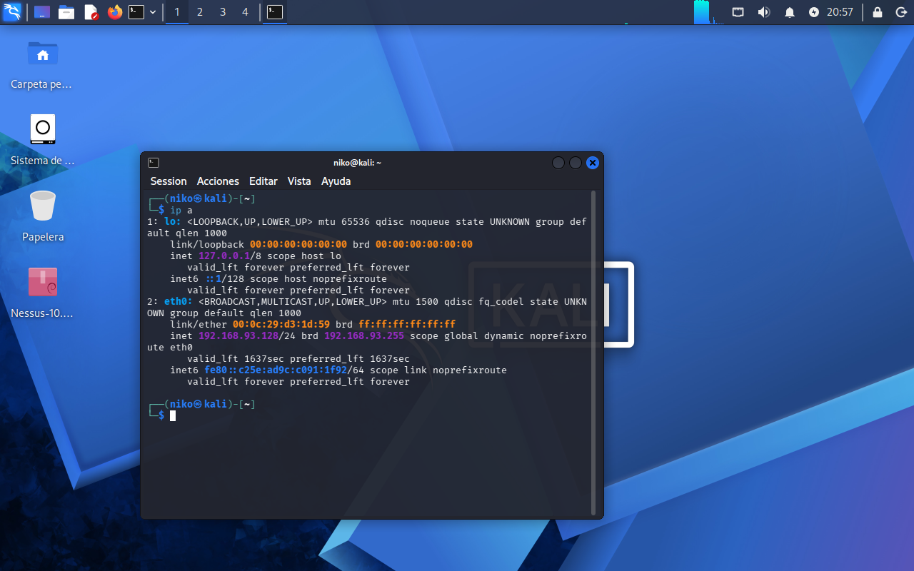
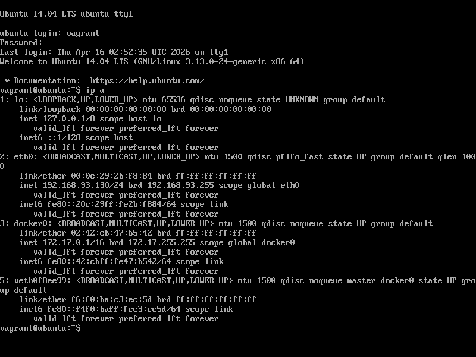
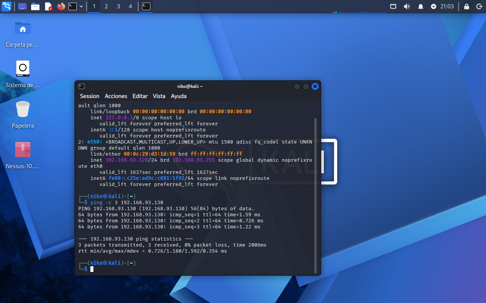
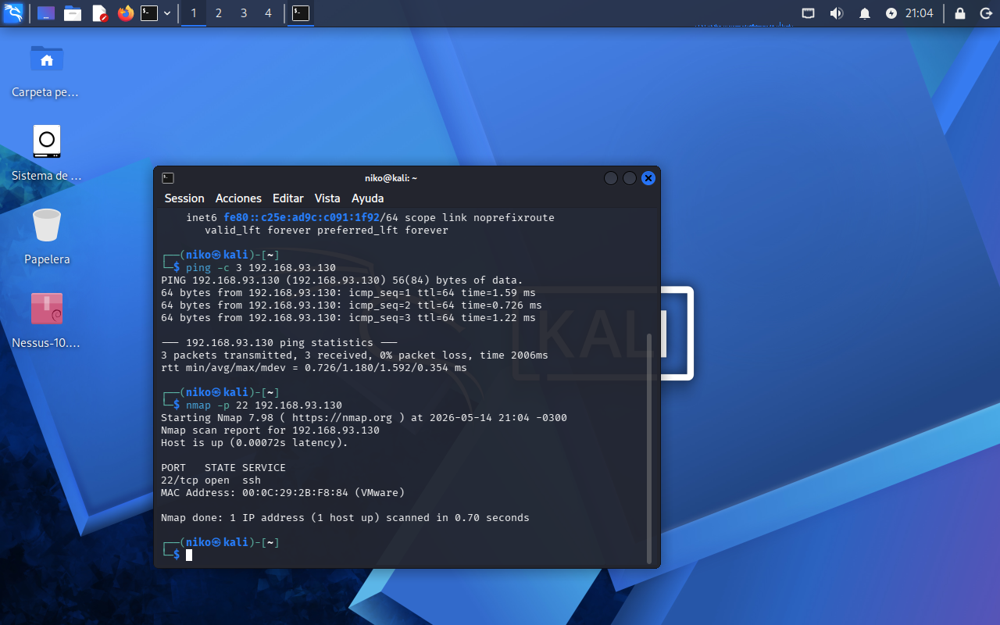
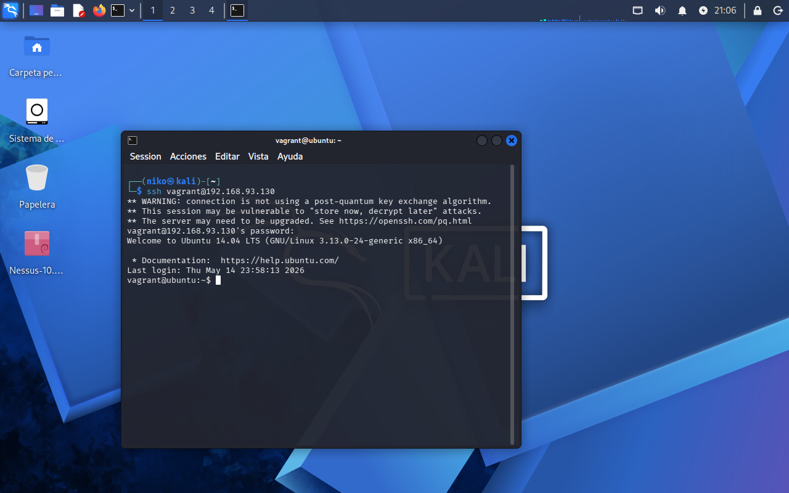
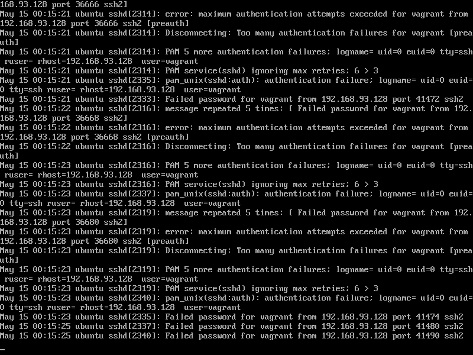
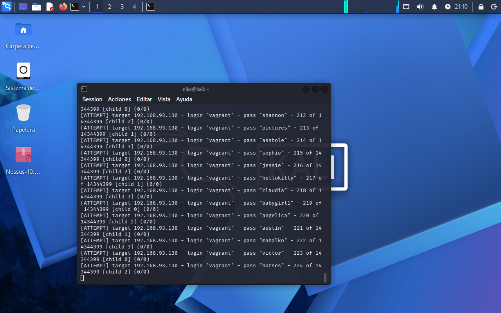

# Blue Team Lab: SSH Brute Force Detection

## Descripción

Este proyecto documenta un laboratorio Blue Team orientado a la detección y análisis de un ataque de fuerza bruta contra el servicio SSH en un entorno controlado.

El objetivo fue simular el trabajo de un analista SOC, identificando actividad sospechosa mediante análisis de logs, clasificación con MITRE ATT&CK y diseño de lógica de detección aplicable a SIEM.

---

## Escenario

- Atacante: Kali Linux — 192.168.93.128  
- Víctima: Ubuntu Server — 192.168.93.130  
- Servicio: SSH  
- Puerto: 22  
- Usuario objetivo: vagrant  

---

## Flujo del ataque

1. Identificación de IP del atacante  
2. Identificación de IP del objetivo  
3. Validación de conectividad  
4. Escaneo de puertos (Nmap)  
5. Acceso al servicio SSH  
6. Ejecución de ataque de fuerza bruta  
7. Análisis de logs de autenticación  

---

## Evidencias

### Configuración de red

  
  

---

### Conectividad

  

---

### Enumeración

  

---

### Acceso al sistema

  

---

### Ataque de fuerza bruta

  

---

### Logs del sistema

  

---

## MITRE ATT&CK

- Táctica: Credential Access  
- Técnica: T1110 – Brute Force  
- Subtécnica: T1110.001 – Password Guessing  

---

## Detección

El patrón identificado corresponde a múltiples intentos fallidos de autenticación desde una misma dirección IP en un corto período de tiempo.

### Lógica de detección

- Más de 5 intentos fallidos  
- Desde una misma IP  
- En menos de 60 segundos  

---

## Informe completo

[Ver reporte completo](report/Incident-Report-SSH-BruteForce-NicolasSotomayor.pdf)

---

## Autor

Nicolás Sotomayor  
SOC Analyst (Junior) | Blue Team | Cybersecurity
